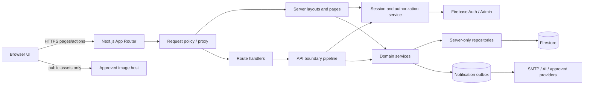
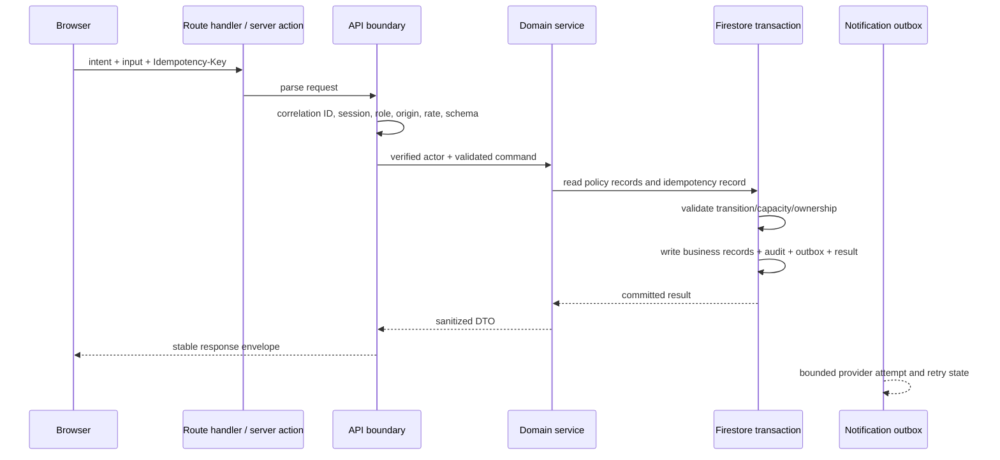

# Technical Design Document

## Overview

This design hardens and modernizes the existing Sandyfeet Resort Next.js 16 App Router application without changing its product scope. It replaces browser-authoritative identity and direct privileged Firestore access with server-authoritative sessions, authorization, validation, transactions, and audit boundaries. In parallel, it introduces shared accessibility, responsive-layout, motion, visual-token, and asynchronous-state contracts across public, guest, staff, admin, and chatbot surfaces.

The design uses the complete `requirements.md` as its source of truth. Implementation is intentionally incremental: compatibility adapters preserve active URLs and existing Firestore records while writes move behind server services, then reads and UI surfaces migrate to shared contracts. Security boundaries are established before cosmetic modernization so that redesigned screens do not reproduce unsafe data flows.

### Goals

- Make authentication, role, ownership, state-transition, and account-status decisions on trusted server data.
- Make reservation, payment, refund, check-in, and audit mutations atomic and idempotent.
- Define every active page and API once in a canonical route manifest and eliminate dead redirects.
- Apply bounded validation, abuse controls, safe errors, browser security headers, and external-service adapters.
- Establish shared accessible components, design tokens, motion behavior, responsive rules, and async recovery states.
- Add reproducible unit, property, integration, accessibility, route, browser, runtime smoke, and performance verification.

### Non-goals

- Production deployment, data migration execution, credential rotation, provider reconfiguration, and final visual approval.
- Replacing Firebase/Firestore, SMTP, Cloudinary, QR scanning, or the configured AI providers.
- Rebuilding all pages at once; adapters and route-compatible migration are explicit parts of the design.

### Repository Findings and Design Consequences

| Finding in active source | Design consequence |
|---|---|
| `app/login/page.js`, `middleware.js`, `components/SessionGuard.js`, and `components/admin/withAuth.js` trust script-readable role/session values | Exchange a verified Firebase identity token for an `HttpOnly` server session; every protected server boundary resolves identity and role again. |
| Guest, reservation, payment, check-in, and audit flows write Firestore directly from client components | Introduce server-only repositories and domain services; retain client SDK only for explicitly public/read-only uses allowed by deployed rules. |
| Availability is calculated in `lib/reservationAvailability.js`, but bookings are written later and multi-room children are sequential | Keep pure calculations, add per-date capacity ledgers, and commit ledgers plus parent/children in one Firestore transaction. |
| Check-in stores a raw token, emits a missing `/check-in` URL, and does not consume credentials | Store a keyed digest, add the active `/check-in` consumption route, and atomically consume the credential with reservation transition. |
| `lib/auditLogger.js` trusts local storage and writes from the browser | Audit events are server-generated from verified identity and committed with the protected business mutation. |
| UI tokens, dialogs, reduced motion, and async states are local and inconsistent | Add shared token layers and accessible primitives, then migrate surfaces by risk and reuse. |
| `package.json` has no automated test command or framework | Add one-shot, separated test commands and a layered verification suite before migration completion. |
### Research Summary

The design was informed by static inspection of active `app/`, `components/`, `lib/`, `middleware.js`, `next.config.mjs`, `eslint.config.mjs`, and `package.json` files. Generated output, history, dependencies, Git metadata, and `.env` values were excluded. The active package baseline pins Next.js `16.1.6`, React `19.2.3`, Firebase client `12.10.0`, and Firebase Admin `13.7.0`; `package.json` currently exposes only development, build, start, and lint scripts. The active request boundary is still `middleware.js`, so implementation must treat migration to the Next.js 16 request-proxy convention as a compatibility change while retaining final authorization in server layouts and handlers.

The design follows the established platform direction documented by the [Next.js authentication guide](https://nextjs.org/docs/app/guides/authentication), [Next.js Content Security Policy guide](https://nextjs.org/docs/app/guides/content-security-policy), [Firebase session cookie guidance](https://firebase.google.com/docs/auth/admin/manage-cookies), [Firestore transaction guidance](https://firebase.google.com/docs/firestore/manage-data/transactions), [WAI-ARIA modal dialog pattern](https://www.w3.org/WAI/ARIA/apg/patterns/dialog-modal/), and [WCAG 2.2](https://www.w3.org/TR/WCAG22/). External documentation retrieval was unavailable in this design session, so implementation must confirm version-specific APIs against these official sources and the pinned package versions before coding.

A route-tree reconciliation also found one approved-baseline discrepancy: `requirements.md` classifies `/calendar` as an active public/guest page, but the current active `app/` tree has no `app/calendar/page.js`. Requirement 4.1 makes the approved Repository Baseline authoritative for this design. The route coverage gate must therefore remain failed until `/calendar` is restored and classified, or the requirements are explicitly clarified to remove or reclassify it; the design does not silently discard the approved route.

Key conclusions are:

1. Edge/proxy checks may improve navigation behavior, but authorization must remain in server layouts, route handlers, and the data-access layer because only those boundaries can verify the session and authoritative account document.
2. Firestore transactions alone do not define capacity policy; deterministic per-date ledger documents provide the contention points needed to prevent overbooking and avoid expensive full-collection availability scans.
3. Business mutations and provider notifications have different failure semantics. The mutation commits with an outbox record; notification delivery retries independently and never rolls back valid business state.
4. Accessibility and responsive behavior require component contracts, not page-specific patches. Dialog, form-field, calendar, navigation, table, image, live-region, and async-state primitives are migration boundaries.
5. Property-based testing is valuable for route policy, date/capacity calculations, serializers, state machines, idempotency logic, sanitization, and reducers. It is not used to repeatedly call Firebase, SMTP, AI, browsers, or other external systems.

## Architecture

### Target Context



All arrows from the browser to protected data terminate at a Next.js server boundary. Client components never choose an actor, role, owner, price, balance, capacity result, audit identity, or business status. They submit intent plus an idempotency key and render the server result.

### Layering and Dependency Rules

```text
app/** page/layout/route
  -> lib/server/http | lib/server/auth | lib/server/domain
  -> lib/server/repositories | lib/server/integrations
  -> Firebase Admin / external provider SDKs

components/**
  -> components/ui | lib/client | shared pure domain modules
  -X-> lib/server/**

shared pure modules
  -> schemas, route manifest, state machines, calculations, serializers, formatters
  -X-> browser globals, Firebase Admin, network, filesystem
```

Proposed module boundaries:

- `lib/routes/manifest.js`: framework-neutral canonical route declarations and matching helpers.
- `lib/domain/**`: pure status policies, calculations, serializers, reducers, safe-format parsing, and invariants.
- `lib/server/firebase-admin.js`: single fail-fast Admin initialization.
- `lib/server/auth/**`: session exchange, verification, account resolution, role/ownership authorization, and sign-out/revocation.
- `lib/server/http/**`: request parsing, schema validation, origin enforcement, rate limiting, correlation IDs, response envelopes, cache policy, and redacted logging.
- `lib/server/repositories/**`: typed/JSDoc Firestore conversion and least-privilege projections.
- `lib/server/services/**`: reservation, payment, refund, check-in, audit, credential, email, and chatbot use cases.
- `lib/server/integrations/**`: bounded SMTP, AI, and approved URL/provider adapters.
- `components/ui/**`: shared interaction and presentation primitives.
- `lib/client/async/**`: async-state reducer, pending-delay behavior, idempotency-key continuity, and mutation reconciliation.

`server-only` guards must be imported by every `lib/server/**` entry point. Shared pure modules must not import Firebase or React, making them inexpensive to property-test.

### Request and Mutation Flow



### Security Trust Boundaries

- **Untrusted:** URL parameters, headers, cookies before verification, browser storage, Firebase client state, request bodies, uploaded metadata, QR content, provider output, Firestore identifiers supplied by clients, and all rendered user content.
- **Trusted after verification:** Firebase Admin session-cookie result, authoritative `users`/`guestProfiles` account state, server configuration parsed at boot, domain records read in a transaction, and allowlisted route/provider/template declarations.
- **Never trusted from clients:** role, actor UID, owner email, price, balance, status, audit fields, token expiration, recipient, subject, template HTML, or provider hostname.

### Authentication and Authorization

1. The browser signs in with Firebase Auth and sends the fresh Firebase ID token to `POST /api/auth/session` over HTTPS.
2. The route verifies the ID token, resolves `users/{uid}` or `guestProfiles/{uid}`, rejects inactive/unverified/mismatched accounts, and creates a Firebase Admin session cookie.
3. The cookie is named `__Host-sf_session`, `HttpOnly`, `Secure` in production, `SameSite=Lax`, `Path=/`, with no `Domain`; remember-me chooses one of two documented bounded lifetimes rather than the current ten-year lifetime.
4. The browser discards app-created tokens and role/expiry storage. Display-only actor data comes from `GET /api/auth/me` or server-rendered session context and is never used for authorization.
5. `resolveSession()` verifies the session cookie with revocation checking, reloads authoritative account status/role, and returns `{ uid, role, accountType, status, emailVerified, sessionIssuedAt }`.
6. `requireActor`, `requireRole`, and `requireOwnedResource` are used by protected layouts and every protected route handler. Admin requires `admin`; staff surfaces allow `staff|admin`; guest surfaces require an active guest identity.
7. Sign-out clears the cookie and revokes refresh tokens for security-sensitive/global sign-out. Deactivation and role changes revoke tokens and still take effect immediately because account status/role are re-read on each protected request (optionally through a short, revocation-aware cache).
8. The request policy layer may reject obviously missing cookies and route unauthenticated users, but it is not the final authorization boundary. Protected layouts and handlers always verify again before data access.
9. Return paths pass `normalizeReturnPath`: relative path only, no scheme/host/backslash/control characters, must resolve to an active route allowed for the actor. Unauthorized users go to `/dashboard/admin/overview`, `/dashboard/staff/overview`, the guest account/bookings surface, or `/login` as appropriate.

### Canonical Routing

`ROUTE_MANIFEST` is a version-controlled array of records:

```js
{
  id, kind: 'page' | 'api', pattern, methods,
  audience: 'public' | 'guest' | 'staff' | 'admin' | 'staff-or-admin',
  status: 'active' | 'legacy-redirect', landingForRole?, redirectTo?,
  csrf: boolean, rateLimitPolicy?, sensitiveResponse: boolean
}
```

The manifest contains every route listed in the approved Repository Baseline and every route discovered from active `app/**/page.js` and `app/**/route.js` files. Discovery and baseline are independent inputs: missing approved routes, unclassified discovered routes, duplicate IDs/patterns, unsupported methods, and redirect cycles all fail the build-time coverage check. The current `/calendar` baseline/workspace discrepancy is therefore an explicit blocking coverage result, not an implicit deletion. Dynamic patterns compile to matchers with named parameters. `/room/:slug` is a legacy redirect preserving an encoded valid slug to `/rooms/:slug`. `/check-in` becomes an active public credential-entry page that reveals no reservation data until server validation; consumption requires an authorized staff flow or an explicitly approved self-check-in policy. `/dashboard` resolves the verified role landing page. Internal links and redirects use manifest helpers rather than string literals where practical. `not-found.js` and route-segment `error.js` files provide public/role-aware recovery without diagnostics or secrets.

Because the application is pinned to Next.js 16, the coarse request-policy layer is implemented using the supported request-proxy file convention and replaces the current `middleware.js` route lists. The proxy may perform cheap manifest matching, safe return-path construction, and missing-cookie routing, but it must never derive authority from unsigned role/UID/expiry cookies and is never the final authorization boundary.

### API Boundary Pipeline

Every route handler is composed with one `withApiBoundary(policy, handler)` pipeline:

1. create/accept a non-secret correlation ID;
2. reject unsupported method with `405` and `Allow` and unsupported media type with `415`;
3. enforce a bounded body size before parsing and return generic `400` for malformed JSON;
4. verify session and route policy;
5. enforce `Origin`/`Host` same-origin checks for authenticated mutations, supplemented by `SameSite` cookies;
6. apply an operation-specific Firestore-backed rate limit keyed by a server-secret digest of actor or normalized client address plus operation;
7. parse with explicit schemas (Zod is the preferred implementation library) using strict objects, trimmed strings, finite numbers, length/range limits, enums, and URL allowlists;
8. invoke the domain handler with verified actor and validated input;
9. serialize an allowlisted DTO in a stable envelope `{ ok, data?, error?, correlationId }`;
10. apply `Cache-Control: no-store, private` to authentication, personal, financial, token, and mutation responses;
11. redact logs and map errors to stable categories without stack/provider detail.

`/api/send-email` is replaced by predefined operations such as `guest-verification`, `move-date`, `refund-status`, and `id-document-request`. The client supplies only operation-specific IDs/fields; the server resolves recipients, subject, and escaped template values. `/api/chatbot` accepts at most 1,000 Unicode characters and the newest 10 strict `{ role: 'user'|'assistant', text }` entries after validation.

### Browser Security Policy

- Configure a per-request CSP nonce and emit a documented `Content-Security-Policy`; begin in report-only mode only during migration, then make enforcement a release gate. Directives explicitly cover `default-src`, `script-src`, `style-src`, `font-src`, `img-src`, `connect-src`, `frame-src`, `frame-ancestors`, `base-uri`, `form-action`, and `object-src`. Sources are limited to self, required Firebase endpoints, and the existing Cloudinary/Google image hosts after verification.
- Emit production HSTS, `X-Content-Type-Options: nosniff`, `Referrer-Policy: strict-origin-when-cross-origin`, and a restrictive `Permissions-Policy`; use CSP `frame-ancestors 'none'` and optionally `X-Frame-Options: DENY` for legacy defense.
- External URL schemas accept HTTPS only (except explicit local development), normalize hostname case/IDNA, reject credentials and ambiguous forms, and compare exact hostnames against per-operation allowlists.
- User/provider content renders as text by default. Chatbot rich text is parsed to a tiny AST (paragraph, line break, emphasis, strong, safe same-origin/approved HTTPS link) and rendered as React nodes; raw HTML and `dangerouslySetInnerHTML` are prohibited.
- `redactForLog` recursively removes passwords, tokens, cookies, authorization headers, codes, payment evidence, document URLs, and configured PII keys while retaining correlation, event type, actor UID, and safe operational metadata.

### Data and Domain Migration Strategy

1. **Establish foundations:** environment schema, Admin initialization, correlation/redaction, route manifest, session exchange, authorization helpers, and security headers.
2. **Close P0 mutations:** move credentials, email, check-in, admin/staff writes, guest profile writes, reservation/payment/refund/audit actions behind APIs.
3. **Introduce transactional records:** backfill capacity ledgers and normalized status fields with reconciliation reports; dual-read legacy fields but single-write canonical fields during the compatibility window.
4. **Restrict clients:** deploy and smoke-test Firestore rules denying privileged collections and ownership violations; remove obsolete client writers only after server paths pass.
5. **Modernize primitives:** tokens, modal/focus manager, form field, async state, navigation, calendar, table, image, and motion contracts.
6. **Migrate surfaces:** reservation/payment/check-in first, then authentication/account, dashboards, public pages, and chatbot.
7. **Enforce and verify:** CSP enforcement, runtime rules/headers/provider checks, accessibility/performance evidence, and removal of compatibility adapters.

Each stage has a rollback boundary. Security-rule tightening is deployed only after its server path is live. Ledger backfill is idempotent and records discrepancies rather than silently changing reservations.

## Components and Interfaces

### Server Foundation

#### `firebaseAdmin`

A single fail-fast initializer validates the service-account JSON and required project identity before exporting Admin Auth and Firestore. It never logs credential content. Missing/invalid production configuration prevents startup rather than falling back to a partial app.

#### `SessionService`

```js
createSession(idToken, rememberMe): Promise<SessionCookieResult>
resolveSession(cookie, { checkRevoked: true }): Promise<Actor>
revokeActorSessions(uid): Promise<void>
clearSessionCookie(response): void
```

Authentication failures are account-neutral. `Actor` is constructed from verified token UID plus authoritative account data; role, status, email verification, and expiry are never accepted from request bodies/cookies.

#### `AuthorizationService`

```js
requireActor(request): Promise<Actor>
requireRole(actor, allowedRoles): void
requireOwner(actor, resource): void
assertTransition(machine, from, to, actor, context): void
```

Errors are typed internally (`Unauthenticated`, `Forbidden`, `NotFound`, `Conflict`) and converted to generic HTTP envelopes at the API boundary.

#### `RouteRegistry`

```js
matchRoute(pathname, method?): RouteDefinition | null
landingFor(actor): string
normalizeReturnPath(raw, actor?): string | null
buildRoute(id, params?, query?): string
assertManifestCoverage(discoveredRoutes): CoverageResult
```

The registry owns route classification, role policy, active/legacy status, methods, redirect destinations, and sensitive-response metadata. Build/test discovery compares `app/**/page.js` and `app/**/route.js` to manifest records.

#### `ApiBoundary`

```js
withApiBoundary(policy, async ({ request, actor, input, correlationId }) => result)
```

`policy` declares authentication, roles, body schema, media types, origin requirement, rate limit, response schema/projection, cache behavior, and timeout. The wrapper centralizes consistent errors and guarantees no handler receives unvalidated input.

#### `RateLimitService`

Uses deterministic HMAC keys and transactionally updated fixed-window/token-bucket records with operation-specific limits. Responses include `429`, `Retry-After`, and no identifying key. Authentication, credential verification, email, chatbot, external calls, and mutations have separate policies; test and local modes use an in-memory adapter behind the same interface.

### Credential Service

```js
issueCredential({ purpose, actorUid, subject, ttlMs, maxAttempts }): Promise<{ token, expiresAt }>
validateCredential({ purpose, token, actorUid?, subject? }): Promise<CredentialRecord>
consumeWithMutation(command, mutation): Promise<Result>
```

Raw credentials are 32 random bytes encoded as base64url. Storage contains an HMAC-SHA-256 digest using a dedicated rotating secret/key ID, purpose, UID/subject binding, timestamps, maximum/failed attempts, and consumed state. Validation compares digests in constant time where applicable and returns one public `invalid_or_expired` category. Success and its account/check-in mutation occur in one transaction. Links use configured `APP_ORIGIN` and manifest route IDs only; raw credentials, reset passwords, identity tokens, and codes are excluded from logs.

Device challenges bind pending UID, normalized email, device fingerprint digest, submitted UID, purpose, expiry, and attempts. Account lookup endpoints always return the same accepted response whether an account exists.

The canonical server password policy preserves the strongest currently enforced registration behavior while making every creation/reset surface consistent: passwords contain 6–128 Unicode code points, include at least one ASCII uppercase letter, one ASCII lowercase letter, one digit, and one character from the documented special-character set `!@#$%^&*(),.?":{}|<>`, contain no NUL/control characters, and are evaluated without trimming or silent normalization. The UI may provide stronger-length guidance, but the same shared schema is enforced by registration, staff creation, and every reset handler. Any future change to these acceptance rules is a versioned product-policy change rather than a page-local validation edit.

### Data Access Layer

Repositories receive an `Actor` or an internal system capability and expose operation-specific methods, not arbitrary collection access. Converters normalize Firestore timestamps and legacy field names; DTO mappers return only fields needed by each surface.

```js
bookingRepository.getOwnedSummary(actor, bookingId)
bookingRepository.getForStaff(actor, bookingId, projection)
guestRepository.updateOwnProfile(actor, validatedPatch)
paymentRepository.getGuestPaymentStatus(actor, bookingId)
```

Submitted email/UID/booking/parent IDs locate candidates but do not authorize them. Ownership is matched to verified UID; legacy email-owned records are resolved through a server migration mapping and never by trusting a submitted email. Unauthorized resource responses use policy-selected `404` or `403` without field disclosure. Firestore Security Rules remain defense in depth and deny client writes to roles, account status, verification state, credentials, audits, payment/check-in state, capacity ledgers, idempotency, and outbox records.

### Reservation Service

Pure policy functions remain separate from transaction orchestration:

```js
normalizeLocalDate(value, resortTimeZone): LocalDate
occupiedDateKeys(checkIn, checkOut): LocalDate[]
calculateRoomDemand(command): Map<roomId, units>
calculateDayTourDemand(command): { adults, children, seniors, total }
calculateAuthoritativePrice(inventory, command): Money
serializeBookingDraft(draft): string
deserializeBookingDraft(raw): BookingDraft | EmptyDraft
```

`createReservation(actor, command, idempotencyKey)`:

1. validates guest/account eligibility, local dates, bounded stay/group size, inventory IDs, guest counts, and payment prerequisites;
2. loads authoritative room/day-tour inventory and pricing;
3. derives nights, room count, category counts, total, down payment, and balance with integer minor currency units;
4. computes deterministic ledger keys for every affected local date and inventory resource;
5. in one Firestore transaction, reads idempotency and ledger docs, verifies remaining capacity/exclusive-resort policy, writes ledger deltas, parent/child bookings, audit event, optional notification outbox item, and the stored operation result;
6. returns the original stored result if the same actor/operation/key is retried, and rejects key reuse with a different canonical command hash.

Room occupancy is check-in inclusive/check-out exclusive. Day-tour occupancy is one local resort date with separate adult/child/senior counts plus total capacity. `ACTIVE_OCCUPANCY_STATUSES` becomes one canonical policy used by reads, state transitions, ledgers, cancellation, and reconciliation. Exclusive resort reservations acquire a whole-resort date ledger and validate room plus tent capacity. Edit/cancel computes old and new ledger deltas and updates every group record atomically. Failed transactions make no visible business or capacity change.

Firestore transaction size constrains maximum stay length and Booking_Group size; schemas reject commands that could exceed the documented write/read budget. A reconciliation job can recompute ledgers from canonical bookings and report—not silently overwrite—differences.

### Payment, Refund, Check-In, and Audit Services

State machines are explicit adjacency maps with guards:

- Payment request: `requested -> details_provided -> proof_submitted -> under_review -> approved|rejected|cancelled`.
- Reservation payment: `unpaid -> deposit_pending -> partially_paid -> paid`, with refund substates linked to cancellation eligibility.
- Refund: `not_requested -> requested -> approved|rejected -> processing -> refunded|failed`.
- Check-in: eligible reservation statuses transition to `checked_in`; consumed credentials cannot transition again.

The exact normalized names become canonical constants; legacy values are mapped at repository edges. Every command verifies actor role, current state, reservation state, evidence metadata, and allowed transition. Monetary values use integer centavos and are derived from authoritative booking/payment records. Idempotency records prevent duplicate financial effects.

Payment/refund transition, balance/evidence updates, immutable audit event, and notification outbox record commit in one transaction. Ineligible refund requests create neither transition nor notification. Provider delivery later marks the outbox `pending|processing|delivered|retryable_failed|terminal_failed`; a committed business state remains committed if delivery fails.

Check-in issuance validates reservation eligibility and writes a digest-backed credential. The QR encodes only an approved Sandyfeet HTTPS URL and opaque credential; no third-party QR generation receives it. Consumption validates digest, purpose, interval, unconsumed state, and reservation state, then marks token consumed, transitions all applicable group records, and writes audit data atomically.

`AuditService.append(tx, event)` ignores client actor/event fields and derives:

```js
{ actorUid, actorRole, action, targetType, targetId, reason?,
  correlationId, idempotencyKey?, occurredAt, before, after, schemaVersion }
```

Clients have no update/delete permission on `auditEvents`. Sensitive fields are excluded or represented by safe metadata/digests.

### Notification and External-Service Adapters

Adapters accept minimal operation DTOs, enforce HTTPS/approved hosts, set deadlines with `AbortController`, validate response schemas/content type/size, and map provider errors to stable internal categories. They never receive full booking/account documents when a name, approved address, and operation fields suffice.

`NotificationOutboxWorker` claims due entries with a lease, renders one server-owned template, sends it, and records delivery or bounded exponential-backoff state. Retry uses the outbox/idempotency identity. Email links derive from trusted origin plus manifest paths.

`ChatbotService` performs deterministic preprocessing before provider calls: validate/trim message, select the newest ten valid user/assistant entries, remove unsupported fields, prepend a server-owned resort scope, and enforce timeout/output size. Provider output is treated as untrusted text and converted to the safe formatting AST. If providers fail, the service returns local resort facts or a contact/authorized workflow recovery response. Requests for booking/payment/sensitive data/actions produce navigation/contact guidance, never a business mutation.

### Shared UX System

#### Design Tokens

`app/globals.css` becomes the canonical CSS custom-property layer with semantic roles rather than page-specific colors:

- typography: family, size, line height, weight;
- color: canvas/surface/text/border/action plus info/success/warning/danger and all interaction states;
- spacing, radius, elevation, z-index, control min-size;
- motion duration (`instant`, `fast=100ms`, `standard=200ms`, `slow=300ms`) and easing;
- focus ring and disabled/loading treatment.

Tailwind theme variables reference these tokens. CI scans production source for invalid utility tokens and disallowed raw color/font declarations, with a temporary migration allowlist that must trend to zero. Data formatters centralize Philippine currency (PHP), resort-local dates/times, booking IDs, and status labels.

#### Component Contracts

- `Button`/`IconButton`/`Link`: semantic element, accessible name, 44×44 target or equivalent spacing, variants, pending/disabled states, and no nested interactive controls.
- `FormField`: persistent label, description, required state, `aria-describedby`, inline error, and an error summary that focuses/announces after invalid submit.
- `Dialog`: portal, name/description, initial meaningful focus, focus trap, background inertness, scroll lock, topmost Escape handling, viewport-safe layout, and opener focus restoration.
- `Popover`/`Menu`: correct trigger-expanded relationship, roving/managed keyboard behavior, topmost dismissal, and focus return.
- `LiveRegionProvider`: polite status, assertive alert, and chatbot log channels; duplicate announcements are coalesced.
- `Calendar`: grid semantics, full date labels, selected/today/unavailable states, named month controls, arrow/Home/End/PageUp/PageDown navigation, and local-date values.
- `ResponsiveTable`: semantic table inside a labeled one-axis scroll region or an equivalent labeled card list; it never causes page-level two-dimensional scrolling.
- `Navigation`: semantic links, `aria-current="page"`, role-correct terminology, desktop sidebar, and a below-1024px modal/drawer variant that never covers primary content when closed.
- `Image`: required intrinsic/aspect dimensions, responsive `sizes`, meaningful `alt`, or empty alt/hidden decorative icon.
- `AsyncRegion`: labeled loading, empty, error/retry, partial, success, and stale/reconciling states without replacing valid content unnecessarily.

#### Motion System

Transitions use token durations between 100–300ms and animate opacity/small transforms only when target position/input availability remain stable. Progress indicators are not treated as decorative transitions. Carousel/repeating motion has a visible pause control and pauses on hover or focus-within. `prefers-reduced-motion: reduce` globally disables smooth scrolling, parallax, pulsing, bouncing, carousel/repeating animation, large transforms, and nonessential entrances/exits while retaining immediate state, progress text, and focus indicators. Route changes do not animate away interactive content before navigation is committed.

#### Responsive and Zoom Behavior

Layouts are content-first from 320–1440 CSS pixels and use wrapping/minmax/grid rather than fixed page widths. No page requires simultaneous horizontal and vertical page scrolling; only labeled tables may scroll on one axis. Dashboard navigation collapses below 1024px. Overlays use dynamic viewport units, safe-area insets, capped height, and internal scrolling. Forms use `scroll-padding`/`scroll-margin`; focused fields and primary actions remain reachable with the virtual keyboard. Resize does not reset React form/draft state. Tests cover 200% and 400% zoom/reflow and prevent text clipping.

#### Async State System

The shared reducer models `idle | pending | success | empty | partial | error | reconciling`. A 300ms delay suppresses flashing loaders for fast reads but controls disable immediately for business-effect mutations. Mutation controllers generate one idempotency key per user intent, retain it through retries/navigation, and clear it only after terminal success/cancel. Errors preserve valid input and expose retry or a safe next action. Success invalidates/reconciles all affected cache/view keys. Route errors are separate from not-found. Secondary failures preserve primary data and label unavailable regions.

### Verification Interfaces

Preferred implementation tooling is Vitest for unit/integration tests, `fast-check` for property tests, React Testing Library plus `user-event`/`jest-axe` for component accessibility, Playwright plus `@axe-core/playwright` for route/browser checks, and Firebase Emulator Suite for Auth/Firestore/Rules/transaction tests. Exact versions must be pinned when dependencies are added.

One-shot scripts:

```text
npm run lint
npm run build
npm run test:unit -- --run
npm run test:property -- --run
npm run test:integration -- --run
npm run test:browser
npm run test
```

No watch/server command is used in CI. Browser tests start the application through Playwright configuration, not an interactive development server.

## Data Models

All records include `schemaVersion`, server timestamps, and normalized enums. Public DTOs are narrower than stored records. Examples below describe logical shape; Firestore converters enforce it.

### Actor and Account

```js
Actor = {
  uid, role: 'guest'|'staff'|'admin', accountType,
  status: 'active'|'inactive', emailVerified, sessionIssuedAt
}

Account = {
  uid, normalizedEmail, displayName, role, status, emailVerified,
  createdAt, updatedAt, sessionRevokedAfter?, schemaVersion
}
```

Role/status/email verification are server-write-only. Identity-document references are stored separately with restricted metadata and never included in general account DTOs.

### Session and One-Time Credential

```js
OneTimeCredential = {
  id, digest, keyId, purpose, actorUid, subjectDigest?,
  expiresAt, consumedAt, failedAttempts, maxAttempts,
  createdAt, schemaVersion
}
```

The raw token exists only in the one response/link. Expired, consumed, purpose/subject mismatch, and unknown records map to one public failure. Session cookies are managed by Firebase Auth/Admin and are never duplicated in Firestore or browser storage.

### Route Definition

```js
RouteDefinition = {
  id, kind, pattern, methods, audience, status,
  redirectTo?, landingForRole?, csrf, rateLimitPolicy?, sensitiveResponse
}
```

Patterns and generated paths are normalized. The manifest is source code rather than mutable runtime data.

### Reservation and Booking Group

```js
BookingGroup = {
  id, ownerUid, type: 'room'|'day-tour', childIds,
  status, checkIn?, checkOut?, selectedDate?,
  guestCounts, totals, paymentStatus, createdAt, updatedAt, schemaVersion
}

Booking = {
  id, bookingId, parentBookingId?, ownerUid, inventoryId,
  occupancyStatus, checkIn?, checkOut?, selectedDate?,
  roomUnits?, tentCount?, guestCounts?, pricingSnapshot,
  paymentStatus, checkInStatus, createdAt, updatedAt, schemaVersion
}

CapacityLedger = {
  key, localDate, inventoryId, capacityType,
  capacity, reserved, categoryReserved?, exclusiveLockGroupId?,
  revision, updatedAt, schemaVersion
}
```

Money is integer centavos. `guestCounts` has non-negative integer `adults`, `children`, `seniors`, and derived `total`. Local dates are `YYYY-MM-DD` in the configured resort time zone; timestamps represent instants. Ledger keys are deterministic, for example `room:{inventoryId}:{localDate}` and `day-tour:{inventoryId}:{localDate}`.

### Booking Draft

```js
BookingDraft = {
  version, kind, checkIn?, checkOut?, selectedDate?,
  selections, guestCounts, paymentMethod?, allowedOptionalFields
}
```

Serialization emits a versioned JSON envelope after normalization and excludes identity, price, status, token, and server-owned fields. Deserialization checks size, JSON shape, version, enums, numbers, dates, and selection limits. Invalid/unsupported data returns `{ state: 'empty', reason: 'invalid-storage' }`; a valid round trip returns an equivalent normalized draft.

### Idempotency and Operation Result

```js
IdempotencyRecord = {
  scope, actorUid, keyDigest, commandDigest, status,
  resultCode, resultProjection, businessEntityIds,
  createdAt, expiresAt, schemaVersion
}
```

The uniqueness key is `{scope}:{actorUid}:{keyDigest}`. Same command returns the stored projection; a different command using the same key returns conflict. Records contain no raw request or sensitive response.

### Payment and Refund

```js
Payment = {
  id, bookingGroupId, ownerUid, state,
  totalCentavos, paidCentavos, balanceCentavos,
  evidenceRefs, version, updatedAt, schemaVersion
}

Refund = {
  id, paymentId, bookingGroupId, state,
  amountCentavos, reasonCode, evidenceRefs,
  requestedBy, approvedBy?, updatedAt, schemaVersion
}
```

Invariants: amounts are finite non-negative integers; `paid + balance = total` except explicitly modeled refund adjustments; every transition increments `version`; evidence metadata is authorized and malware/content-type checked before use.

### Check-In Credential

```js
CheckInCredential = {
  id, digest, keyId, bookingGroupId, purpose: 'check-in',
  validFrom, expiresAt, consumedAt?, issuedBy,
  createdAt, schemaVersion
}
```

No raw credential is copied into booking documents. Reservation eligibility is rechecked when consuming, not inferred from token existence.

### Audit Event

```js
AuditEvent = {
  id, actorUid, actorRole, action, targetType, targetId,
  reason?, correlationId, idempotencyKeyDigest?,
  before, after, occurredAt, schemaVersion
}
```

Events are append-only and use field-level redaction/projections. Failed attempts that matter operationally are separate security events; business events committed with a mutation reflect the committed state.

### Notification Outbox and External Result

```js
OutboxItem = {
  id, operation, templateId, targetRef, payloadProjection,
  status, attempts, nextAttemptAt, leaseUntil?,
  correlationId, idempotencyKeyDigest?, lastErrorCategory?,
  createdAt, deliveredAt?, schemaVersion
}
```

`payloadProjection` contains only server-approved template values. Provider response bodies and secrets are not persisted.

### Async UI State

```js
AsyncState = {
  phase: 'idle'|'pending'|'success'|'empty'|'partial'|'error'|'reconciling',
  data?, fieldErrors?, message?, retryable?, pendingSince?,
  idempotencyKey?, affectedKeys?
}
```

Reducers preserve the last usable `data` for partial/reconciling states and preserve validated user input outside the network result object.

### Verification Evidence Record

```js
VerificationRecord = {
  itemId, requirementRefs, category,
  environment, buildId, toolOrTester,
  result: 'passed'|'failed'|'unverified',
  evidenceRefs, blocker?, blockingDependency?, owner?, followUp?,
  recordedAt, schemaVersion
}
```

`passed` requires evidence. `unverified` requires a non-empty blocker, blocking dependency, owner, and follow-up and never contributes to a passing release gate. Evidence references contain no secrets, raw credentials, identity documents, payment evidence, or unnecessary personal data.

## Correctness Properties

*A property is a characteristic or behavior that should hold true across all valid executions of a system-essentially, a formal statement about what the system should do. Properties serve as the bridge between human-readable specifications and machine-verifiable correctness guarantees.*

This feature is suitable for property-based testing because its route policy, authorization decisions, validation, URL normalization, credential predicates, date/capacity calculations, serializers, state machines, data projections, content safety, formatters, and async reducers are pure or can run against deterministic in-memory models. It does not replace example, integration, browser, security-rule, or runtime testing for cryptography, Firestore transactions, cookies, headers, provider wiring, rendered accessibility, responsive layout, or motion.

### Redundancy Reflection

The prework identified overlapping universal statements. The final set removes redundancy as follows:

- Authentication, role checks, dashboard landing, and manifest access are one authoritative access-matrix property; changing a client claim is a metamorphic input within that property.
- Internal redirects, legacy redirects, role landings, and return paths share route-registry invariants, but adversarial return-path normalization remains separate from ordinary route generation.
- Reservation status classification, room date expansion, category aggregation, authoritative totals, transaction atomicity, and concurrency are distinct concerns. Only the pure policies become properties; atomic/concurrent behavior remains integration testing.
- Server-side reservation/payment/refund idempotency shares one model-based business-effect property. Client-side retry/navigation key continuity remains a separate controller property because preserving a key does not itself prove one committed effect, and a correct server does not prove the browser reused the key.
- Valid booking-draft round trips and malformed-storage recovery remain separate because neither implies the other.
- User/provider content encoding and chatbot safe formatting are one safe-rendering property; external URL/provider approval remains separate.
- Async phase distinction/loading delay, failure/partial recovery, and effect de-duplication/reconciliation remain three properties because each protects a different invariant.

Each remaining property contributes a unique failure signal.

### Property 1: Authoritative route access matrix

For all manifest routes, authoritative actor states, session states, and arbitrary client-supplied roles, identifiers, or expiration values, the access decision shall equal the policy for the verified active actor and shall not change when only client-supplied authority claims change.

**Validates: Requirements 1.1, 1.2, 1.3, 1.4, 1.7, 1.10, 4.2, 4.3, 4.4, 15.2**

### Property 2: Authentication and authorization recovery is safe

For all protected routes and failed authentication or authorization outcomes, the response shall be an allowed unauthenticated/forbidden result or an active role-appropriate destination, and any attached return path shall be a safe same-origin manifest path.

**Validates: Requirements 1.5, 1.6, 4.5**

### Property 3: Return-path normalization rejects untrusted destinations

For all input strings, `normalizeReturnPath` shall return a path only if it is a normalized same-origin active manifest path allowed for the actor; schemes, authorities, backslashes, control characters, ambiguous encodings, and inactive paths shall return no destination.

**Validates: Requirements 4.11**

### Property 4: Generated navigation always resolves

For all route definitions and valid route parameters, route builders, role landing helpers, legacy redirects, and check-in link builders shall produce an active destination in the canonical manifest, and a legacy room redirect shall preserve the normalized slug.

**Validates: Requirements 4.6, 4.7, 4.8**

### Property 5: API schemas form the request boundary

For all request values, an API handler shall receive a value if and only if it satisfies that operation's strict type, format, length, range, enum, body-size, and allowlist schema; rejected values shall not invoke the domain handler.

**Validates: Requirements 2.1, 15.4**

### Property 6: Authenticated mutation origins are same-origin

For all authenticated mutation requests and origin/host combinations, origin validation shall permit the request if and only if its normalized origin equals the configured application origin under the documented development/production policy.

**Validates: Requirements 2.4**

### Property 7: Rate limiting respects operation quotas

For all operation policies and generated sequences of request times and client keys, the rate limiter shall accept no more than the configured quota in a window, shall never produce a negative balance, and shall provide a retry time no earlier than the next permitted request.

**Validates: Requirements 2.3**

### Property 8: Email commands cannot control delivery templates

For all email-operation requests, a command shall be accepted only for a predefined operation, and the resulting recipient, subject, link origin, and template identity shall be derived from authoritative records and server allowlists rather than client-supplied delivery fields.

**Validates: Requirements 2.7, 3.9**

### Property 9: Chatbot input normalization is bounded

For all messages and history arrays, chatbot normalization shall either reject a message longer than 1,000 characters or produce a request containing that valid message and no more than the newest ten valid user/assistant text entries in original relative order.

**Validates: Requirements 2.8, 14.7**

### Property 10: Credential validity requires every binding

For all one-time or device credentials and validation contexts, validation shall succeed if and only if purpose, actor/subject/device bindings, expiration, unconsumed state, and attempt policy all match; changing any required binding shall make validation fail.

**Validates: Requirements 3.3, 3.4, 3.5**

### Property 11: Invalid credential states are publicly indistinguishable

For all unknown, expired, consumed, attempt-exhausted, purpose-mismatched, actor-mismatched, and subject-mismatched credentials, the public validation result shall have the same generic failure category and shall not expose the internal cause.

**Validates: Requirements 3.7**

### Property 12: Account lookup responses are neutral

For all equivalent password-reset or verification requests, changing only whether the named account exists shall not change the public status and accepted-response shape.

**Validates: Requirements 3.8**

### Property 13: Password policy is enforced for every accepted password

For all strings, the server password schema shall accept the string if and only if it meets every documented length and composition rule after the documented normalization policy.

**Validates: Requirements 3.11**

### Property 14: Sensitive values never survive log redaction

For all nested log/error values containing configured sensitive keys or credential patterns, recursive redaction shall remove the sensitive values while preserving a non-secret correlation identifier and safe event metadata.

**Validates: Requirements 3.10, 8.10**

### Property 15: Ownership and role permissions depend only on trusted context

For all actors, resources, actions, current states, and arbitrary submitted IDs/emails, a data operation shall be allowed if and only if the authoritative owner/role permission and state-transition policy allow it, and changing only submitted identity fields shall not grant access.

**Validates: Requirements 5.1, 5.2, 5.3, 5.4, 5.5**

### Property 16: Data and outbound projections disclose only approved fields

For all stored records, requesting surfaces, and external-service operations, every returned or transmitted projection shall contain only keys in the corresponding surface or operation allowlist; adding unapproved or sensitive fields to the source record shall not add them to the projection, and inaccessible existing/missing records shall use the same non-disclosing policy shape.

**Validates: Requirements 5.6, 5.7, 14.1**

### Property 17: Occupancy policy and room date boundaries are canonical

For all statuses and valid local room stays, a booking shall affect capacity if and only if the canonical occupancy predicate says so, and an affecting stay shall contribute exactly once to every local date from check-in inclusive to check-out exclusive.

**Validates: Requirements 6.1, 6.2**

### Property 18: Capacity aggregation preserves category totals and exclusivity

For all generated room/day-tour bookings and inventory ledgers, aggregation shall sum only active occupancy, shall preserve adult/child/senior and total counts for each selected local date, and shall reject demand whenever the declared room, tent, total, or whole-resort exclusive capacity would be exceeded.

**Validates: Requirements 6.3, 6.4, 15.5**

### Property 19: Reservation values are derived from authoritative inputs

For all valid reservation commands and authoritative inventory/pricing snapshots, accepted results shall have night, room, guest, price, deposit, and balance values equal to the reference calculation, independent of conflicting client-supplied derived values; any failed prerequisite shall reject the command.

**Validates: Requirements 6.5, 6.12, 15.5**

### Property 20: Equivalent booking drafts round trip

For all valid `BookingDraft` values, deserializing the serialized draft shall produce an equivalent normalized version with the same allowed dates, selections, guest counts, payment selection, and optional fields.

**Validates: Requirements 6.13, 15.6**

### Property 21: Invalid booking-draft storage always recovers

For all malformed, oversized, unsupported-version, or schema-invalid browser-storage values, deserialization shall not throw and shall return the documented recoverable empty draft state.

**Validates: Requirements 6.14, 15.7**

### Property 22: Idempotent retries have one business effect

For all valid idempotent commands and retry sequences, repeating the same actor, scope, key, and canonical command shall return the original result with one modeled business effect; reusing the key for a different canonical command shall conflict without another effect.

**Validates: Requirements 6.10, 7.4, 15.9**

### Property 23: Business state machines permit only declared transitions

For all payment, refund, reservation, and check-in current/target states and guard contexts, a transition shall be accepted if and only if the state edge is declared, the actor role is allowed, the reservation is eligible, and required evidence is present; terminal states shall have no undeclared outgoing transition.

**Validates: Requirements 7.1, 7.2, 7.6, 7.8**

### Property 24: Audit events derive complete trusted context

For all privileged business transitions, the constructed audit event shall contain the verified actor/role, action, target, required reason, server timestamp placeholder, correlation identifier, safe before/after projection, and retry correlation, independent of client-supplied audit fields.

**Validates: Requirements 7.9, 7.11**

### Property 25: Safe rendering cannot create executable content

For all user/provider strings, response encoding and safe-format parsing shall produce text or an AST containing only documented non-executable nodes and approved links; script, event-handler, raw HTML, frame, style, and disallowed URL constructs shall never appear in rendered output.

**Validates: Requirements 2.9, 8.7, 14.5, 14.8**

### Property 26: External destinations require exact approval

For all parsed URLs, providers, data classifications, and purposes, an external operation shall be permitted if and only if it uses the approved protocol, exact normalized hostname, approved provider, and documented retention purpose required for that data classification; userinfo and ambiguous host forms shall be rejected.

**Validates: Requirements 8.8, 14.2**

### Property 27: Canonical role and data formatting is total

For all supported roles, money values, valid dates/times, booking identifiers, and statuses, shared formatters shall return a non-empty canonical label using the documented role terms, PHP currency rules, resort time zone, identifier shape, and status vocabulary.

**Validates: Requirements 12.6, 12.7**

### Property 28: Async phases are distinct and time-correct

For all async event sequences and pending durations, the reducer shall expose exactly one phase; a loading label shall appear only after more than 300ms of continued pending work, and `empty` shall occur only after a successful collection result containing zero records.

**Validates: Requirements 13.1, 13.3, 15.14**

### Property 29: Async failure and retry preserve usable state

For all valid user inputs, primary data, secondary failures, and retry outcomes, failure shall preserve valid input and usable primary data with an available recovery action, and a successful retry shall remove the stale error and expose success/content.

**Validates: Requirements 13.4, 13.5, 13.8, 15.14**

### Property 30: Async mutations de-duplicate and reconcile effects

For all mutation-controller event sequences, at most one command shall be emitted while an intent is pending, the same idempotency key shall survive retries/navigation until terminal success or cancellation, and success shall mark every declared affected view for reconciliation to the committed result.

**Validates: Requirements 13.2, 13.6, 13.9, 13.10, 15.14**

### Property 31: Chatbot action boundaries cannot trigger business mutations

For all chatbot messages classified as requests to book, pay, reveal sensitive data, or perform unrelated actions, the service shall return an authorized-workflow or contact response and shall emit no reservation, payment, identity, or data-mutation command.

**Validates: Requirements 14.9**

## Error Handling

### Error Taxonomy and Public Mapping

Internal errors carry a correlation ID, safe category, retryability, and optional field issues. Public responses never include stack traces, Firebase/SMTP/AI detail, credential state, raw identifiers beyond authorized DTOs, or sensitive input.

| Internal category | HTTP/UI result | Retry behavior |
|---|---|---|
| `ValidationError` | `400` with generic message and allowlisted field issues | Correct input; same idempotency key may be retained before domain execution |
| `MalformedBody` | `400` generic invalid request | Correct request |
| `Unauthenticated` | `401` or `/login` with safe return path | Reauthenticate; do not loop redirects |
| `Forbidden` | `403` or active role landing | No automatic retry |
| `NotFound` | `404` recovery state | No automatic retry; indistinguishable where disclosure matters |
| `MethodNotAllowed` | `405` plus `Allow` | Use supported method |
| `UnsupportedMediaType` | `415` | Use declared media type |
| `RateLimited` | `429` plus `Retry-After` | Retry only after indicated time |
| `StateConflict` | `409` with refreshed safe state | Reconcile, then require a new intent if needed |
| `IdempotencyConflict` | `409` | Use a new key only for a genuinely new intent |
| `CapacityConflict` | `409` availability changed | Preserve draft, refresh availability, let user choose |
| `ExternalTimeout`/`ExternalUnavailable` | `503` bounded recovery response | Bounded adapter/outbox retry |
| `CredentialInvalid` | `400` or `401` single generic category | Request a new credential where applicable |
| `InternalError` | `500` generic message | User may retry safe/idempotent operation; investigate by correlation ID |

### Failure Semantics

- **Authentication:** clear invalid cookies on verification failure. Do not expose account existence, role mismatch detail, token state, or whether an email/device is registered.
- **Validation:** preserve submitted form values except secrets that should be re-entered. Focus the error summary or first invalid field and associate each message programmatically.
- **Transactions:** transaction failures expose no partial success. On contention, retry only within a bounded server policy; then return conflict with refreshed availability/state.
- **Idempotency:** if the previous operation is still pending, return a stable pending result; if completed, return stored projection; if payload differs, return conflict.
- **Notifications:** business commits are not rolled back by email failure. The UI shows the completed business action and a separately retryable notification state. Staff can retry the outbox operation without repeating the mutation.
- **External providers:** enforce deadlines and response-size/schema checks. Circuit/bounded retry policy prevents request pileups. Chatbot falls back locally; core booking/payment workflows never depend on AI availability.
- **Partial UI data:** retain valid primary data, label only the failed region, and offer targeted retry. Route-level request failure uses `error.js`; missing authorized data uses `not-found.js`.
- **Dialogs/async feedback:** errors remain visible and announced without moving focus unexpectedly. Closing a surface restores focus unless the opener was removed, in which case focus moves to a documented nearby landmark.
- **Logging:** every server failure records category, route/operation, safe actor UID when authenticated, and correlation ID through `redactForLog`. Credentials, authorization/cookie headers, passwords, codes, documents, payment evidence, provider payloads, and raw PII are redacted.
- **Unverified runtime checks:** verification reports use `passed | failed | unverified`; `unverified` requires blocker, environment/dependency, owner, and follow-up action and cannot be represented as passed.

## Testing Strategy

### Approach

The verification suite uses complementary layers. Unit tests cover specific examples, edge cases, state-machine guards, component contracts, and errors. Property tests cover universal pure-logic behavior across generated inputs. Integration tests cover Firebase Admin/Auth, Firestore transactions and Security Rules, cookies, route handlers, outbox/adapters, and React DOM interactions. Browser tests cover complete role journeys, accessibility, viewports, zoom, reduced motion, and security-facing navigation. Controlled-environment smoke and manual evidence cover deployed configuration, providers, assistive technology, and performance.

PBT is not used for rendered layout, CSS contrast, infrastructure/configuration, simple repository CRUD, emails/log side effects, or real provider calls because 100 generated executions would not add proportionate value. Those requirements use snapshots, schema/static checks, mocks, emulator integration, browser tests, or runtime smoke checks.

### Property-Based Testing Configuration

Use the pinned `fast-check` library through Vitest. Every design property above is implemented by exactly one property-based test with at least 100 successful runs; security parsers, URL normalization, serializer, and redaction properties should use 500–1,000 runs in CI when runtime permits. Seeds and minimized counterexamples are printed and retained on failure.

Every test includes this comment/tag format:

```js
// Feature: application-hardening-ux-modernization, Property 20: Equivalent booking drafts round trip
```

Generators constrain values to documented domains and deliberately include Unicode, empty/boundary values, local-date transitions, terminal states, unknown enums, nested objects, and ambiguous URLs. Stateful model commands cover rate limiting, idempotency, credentials, state machines, and async reducers. Firebase/provider calls are replaced by deterministic fakes in property tests; emulator/provider behavior is verified separately.

### Unit and Component Tests

Focus example-based tests on:

- exact HTTP status/envelope cases for malformed body, unsupported method/media type, conflict, rate limit, and provider timeout;
- expiry boundaries, maximum attempt boundaries, password examples, local date/time-zone edges, zero/maximum guest counts, and centavo rounding;
- each payment/refund/check-in transition and forbidden edge;
- safe chatbot examples and reset confirmation with/without user messages;
- `Button`, `FormField`, `Dialog`, `Popover`, `Menu`, `Calendar`, `Navigation`, `ResponsiveTable`, `Image`, `LiveRegion`, and `AsyncRegion` semantics;
- empty, error, partial, retry, reconciling, and success render examples;
- `not-found` versus route error recovery;
- token/design-state snapshots and formatter examples.

React Testing Library tests use `user-event` rather than implementation events. `jest-axe` catches automated accessibility regressions but does not replace keyboard/screen-reader/contrast validation.

### Firebase and API Integration Tests

Run against isolated Firebase Auth/Firestore emulators with deterministic fixtures:

- session exchange, cookie flags, expiry, revocation, inactive/unverified accounts, and authoritative role changes;
- protected route/API matrices for missing, expired, malformed, forged, wrong-role, and valid credentials;
- Security Rules for guest ownership, staff/admin capabilities, evidence/document access, and denial of client writes to protected fields/collections;
- request origin, body/media schemas, response cache headers, stable safe errors, and correlation propagation;
- credential digest storage, generic invalid states, failure exhaustion, and one-winner atomic consumption;
- reservation ledger transactions, forced failures, concurrent last-capacity requests, exclusive locks, group create/edit/cancel, and reconciliation;
- payment/refund/check-in transition plus audit atomicity and idempotent retries;
- outbox commit, delivery claim/lease, retry/backoff, duplicate delivery protection, and provider failure after business commit.

Concurrency tests use a bounded number of simultaneous emulator requests and assert final invariants. They are integration tests, not generated high-volume calls.

### Route and Browser Matrix

Manifest-driven tests evaluate every active page and API for unauthenticated, guest, staff, and admin actors. API methods are checked separately. At least one browser journey per surface family exercises authentication, denial/recovery, successful navigation, and sign-out. Internal-link crawling fails on destinations absent from the manifest. Explicit tests cover `/dashboard`, `/room/[slug]`, `/rooms/[slug]`, `/check-in`, unknown pages, and render failures.

Playwright runs supported widths `320`, `375`, `768`, `1024`, and `1440` CSS pixels. Zoom/reflow coverage uses browser context/device-scale techniques plus 200% and 400% runtime/manual checks where automation cannot faithfully reproduce browser zoom. Tests assert no page-level two-dimensional overflow, reachable controls, 44×44 targets/equivalent spacing, overlay containment, responsive dashboard navigation, preserved resize state, table labeling/single-axis behavior, image dimensions, and layout stability.

### Accessibility and Motion Verification

Automated checks cover accessible names, semantic controls, labels/descriptions, `aria-current`, status/alert/log regions, dialog naming, focus trap/restore, background inertness, Escape stack behavior, calendar keyboard navigation, image alternatives, and axe rules. Keyboard-only browser journeys cover complete representative booking, account, staff, admin, and chatbot workflows.

Contrast checks validate token pairs and computed component states against 4.5:1 normal text and 3:1 large text/meaningful graphics/focus indicators as applicable. Manual runtime records identify browser, viewport, assistive technology, workflow, result, evidence, and issue link.

Playwright emulates `prefers-reduced-motion: reduce`. Assertions verify no parallax, pulse, bounce, carousel/repeating movement, smooth scroll, large transform, or nonessential entrance/exit animation while loading/progress/status feedback remains. Normal-motion checks verify 100–300ms token timings, pause controls/focus-within pause, stable interactive targets, and unrelated navigation availability during loading.

### Security and External-Service Verification

- Static/header tests validate CSP directive presence and source allowlists, HSTS in production, framing, `nosniff`, referrer, Permissions Policy, and no-store mappings.
- CSP begins report-only during migration, with violations reviewed; enforced CSP is required before completion.
- URL/safe-format/redaction fuzz properties cover adversarial inputs; browser tests confirm rendered output is inert.
- SMTP/AI/provider adapters use representative mocked timeout, rejection, malformed response, oversized response, and unavailable-provider cases.
- Configured provider integration is limited to one to three controlled examples per integration. No generated tests send real emails, AI prompts, credentials, documents, or payment evidence.
- Check-in QR generation is inspected to ensure the opaque token remains within approved application/local QR processing boundaries.

### One-Shot Commands and CI Gates

The implementation adds non-watch scripts for lint, production build, unit, property, integration, and browser tests. A typical pipeline is:

1. dependency and environment-schema checks;
2. lint plus forbidden-token/server-import scans;
3. unit and property tests;
4. Firebase emulator integration and Rules tests;
5. production build plus manifest discovery/coverage;
6. Playwright route/accessibility/responsive/reduced-motion tests;
7. controlled-environment smoke checks for a release candidate.

Failures block promotion. Runtime/manual checks may be `unverified` only with the documented blocker and follow-up; P0 security/integrity checks cannot be waived as successful.

### Controlled-Environment Runtime Verification

For each release candidate, record:

- deployed Firestore Security Rules and representative owner/role outcomes;
- parsed environment configuration without secret values;
- external provider permissions, HTTPS, approved data fields, timeouts, and representative delivery/fallback;
- security response headers and CSP violations;
- protected route/API outcomes for all actor classes;
- generated email verification/reset links and check-in links resolving to active routes;
- audit event creation and immutability for representative critical actions;
- keyboard-only and screen-reader workflows, contrast, reflow, touch targets, and reduced motion;
- route loading, interaction responsiveness, responsive image loading, layout stability, and animation timings for representative public, guest, staff, and admin paths.

The report records environment, build identifier, timestamp, tester/tool, evidence link, result, blocker, and follow-up. It contains no secrets, credentials, identity documents, payment evidence, or unnecessary personal data.

### Requirements Traceability

| Requirement | Primary design areas | Primary verification |
|---|---|---|
| 1. Authentication/authorization | Session Service, Authorization Service, route/API boundaries | Properties 1–3; Auth emulator and browser access matrix |
| 2. API safety | API Boundary, Rate Limit, email/chatbot adapters | Properties 5–9, 25; API integration/failure tests |
| 3. Credentials | Credential Service, trusted link construction, redaction | Properties 10–14; credential transaction integration |
| 4. Routing | Route Registry and recovery boundaries | Properties 1–4; manifest discovery and route browser matrix |
| 5. Data access | actor-scoped repositories, DTO projections, Rules | Properties 15–16; Rules/API integration |
| 6. Reservations | pure calculators, capacity ledgers, transactions, draft serializer | Properties 17–22; emulator concurrency/rollback |
| 7. Critical workflows | explicit state machines, idempotency, audit, outbox | Properties 22–24; atomic integration tests |
| 8. Browser policy | CSP/security headers, safe rendering, URL policy | Properties 14, 25–26; header/browser smoke |
| 9. Accessibility | shared semantic primitives and live regions | component tests, axe, keyboard/screen-reader runtime |
| 10. Responsive/touch | layout, overlay, navigation, table, image contracts | viewport/zoom/touch browser matrix |
| 11. Motion | tokenized motion and reduced-motion policy | reduced/normal motion browser checks |
| 12. Visual consistency | semantic tokens, shared components, formatters | Property 27; static scans and visual regression |
| 13. Async recovery | async reducer/controller and reconciliation | Properties 28–30; component/navigation integration |
| 14. External resilience | minimal adapters, safe chatbot, outbox | Properties 9, 16, 25–26, 31; mocked/configured integration |
| 15. Regression/runtime evidence | layered suite, CI, runtime report | all properties plus integration/browser/smoke records |
