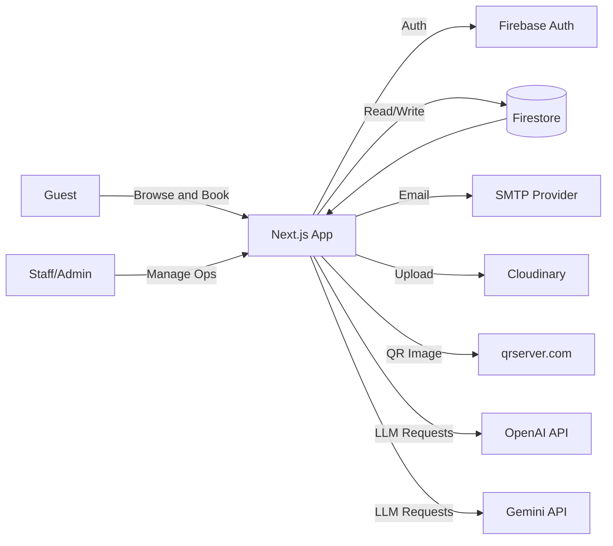

# Sandyfeet Reservation System

## Overview
Sandyfeet is a full-stack reservation and operations system for a beachfront resort in Zambales, Philippines. It supports guest bookings for rooms and day tours, staff and admin operations, payment coordination, QR-based check-in, email notifications, and an AI-assisted chatbot that uses a local knowledge base.

## Product Scope
- Guest experience: room and day tour booking, booking wizard, payment proof uploads, reservation tracking, feedback, guest profile.
- Staff and admin: dashboards for reservations, calendar, availability, payments, rooms, staff, audit logs, notifications.
- Automation: email workflows, ID requests, check-in QR codes, device verification, audit logging.
- Integrations: Firebase, Cloudinary, SMTP email, OpenAI and Gemini (optional), QR generation.

## Tech Stack
### Frontend
- Next.js 16 (App Router)
- React 19
- Tailwind CSS 4
- Heroicons, Font Awesome, Material Icons
- Recharts (charts)

### Backend and Services
- Next.js API routes (serverless)
- Firebase Auth (guest and staff auth)
- Firestore (primary data store)
- Firebase Admin SDK (server-side auth and verification)
- Nodemailer (SMTP email)
- Cloudinary (image uploads)
- OpenAI and Gemini (optional chatbot providers)
- QR tooling: qrcode.react and qrserver.com image API

### Utilities
- html2canvas, jsPDF, jsPDF-autotable (document generation)
- xlsx, xlsx-js-style (data export)
- OpenTelemetry API (instrumentation dependency)

## Architecture
- App Router pages and layouts in app/
- API routes under app/api/
- Firestore client in lib/firebase.js
- Firebase Admin initialization in lib/firebaseAdmin.js
- Email templates and helpers in lib/emailService.js and lib/staffEmailService.js
- Booking helpers in lib/* (availability, status, payment helpers)
- Chatbot knowledge base in public/chatbot-knowledge.md
- Route protection via middleware.js using session cookies

## Core Processes
### Guest account lifecycle
1. Guest signs up with email or Google.
2. Email sign-up creates emailVerificationTokens with 24 hour expiry.
3. Verification link hits /api/verify-guest-email and updates guestProfiles.
4. Guest profile is created or updated in guestProfiles and synced on login.
5. Account deactivation uses accountStatus and sessionVersion to block access.

### Staff and admin account lifecycle
1. Admin creates staff or admin in /api/admin/create-user.
2. User is created in Firebase Auth and users collection.
3. Verification token is emailed and expires in 15 minutes.
4. User verifies via /verify-staff and can log in.

### Room booking flow (guest)
1. Browse Rooms and select dates, guests, room types, or exclusive resort.
2. Checkout uses multi-step flow and persists draft in localStorage.
3. Guest uploads payment proof or requests bank details.
4. Booking is created in bookings (parent and child docs for multi-room).
5. Pending email sent, staff confirms and triggers confirmation email.
6. QR check-in token is generated and included in confirmation email.

### Day tour booking flow (guest)
1. Select date and guest counts with a 2-day lead time.
2. Capacity is enforced by dayTours.maxCapacity and daytour_unavailable_dates.
3. Booking is created in dayTourBookings and pending email is sent.
4. Staff confirms and sends confirmation with check-in QR.

### Payments and bank requests
- GCash or bank transfer for down payment (50 percent default).
- Bank requests stored in bank_requests and daytour_bank_requests.
- Pending payment list supports resume links for incomplete bookings.
- Balance payment method stored as cash or digital.

### Check-in flow
1. Staff or admin generates token via /api/checkin/generate-token.
2. Token stored in checkinTokens and booking documents.
3. QR code links to /check-in?token=...
4. /api/download-qr returns a PNG for guests.

### ID request flow
1. Admin sends ID request via /api/admin/send-id-request.
2. Booking docs are updated with idRequest status.
3. Guest uploads valid ID and creates guest_id_submissions.
4. Notifications are created for staff and admin review.

### Notifications and audit
- Notifications stored in notifications with per-user read status.
- dismissedNotifications prevents repeat alerts.
- Audit logs stored in auditLogs.

### Chatbot flow
1. /api/chatbot builds prompt with local knowledge base.
2. Tries OpenAI, then Gemini, then local fallback.
3. Optional notice controlled by CHATBOT_SHOW_AI_STATUS.

## Domain Definitions
- Booking: A room reservation stored in bookings. Multi-room uses parentBookingId for grouping.
- Day tour booking: A non-overnight visit stored in dayTourBookings.
- Bank request: A request to provide bank details stored in bank_requests or daytour_bank_requests.
- Check-in token: Single-use token stored in checkinTokens and booking docs.
- Guest profile: Auth-linked profile stored in guestProfiles.

## Data Model (Firestore Collections)
- users: staff and admin accounts with role, verificationToken, verificationExpiresAt, emailVerified.
- users/{uid}/devices: trusted devices for staff login.
- guestProfiles: guest profile, emailVerified, validIdType, validIdUrl, mobileNumber, accountStatus.
- rooms: inventory and room metadata (type, price, capacity, images, availability).
- bookings: room bookings with guestInfo, dates, status, payment, checkinToken.
- dayTours: day tour configuration with maxCapacity and pricing.
- activities: day tour activities shown to guests.
- dayTourBookings: day tour reservations with guest counts and payment.
- daytour_unavailable_dates: blocked tour dates and capacity adjustments.
- unavailableSlots: blocked room dates or slots.
- bank_accounts: bank details for payments.
- bank_requests: room booking bank transfer requests.
- daytour_bank_requests: day tour bank transfer requests.
- feedbacks: guest feedback linked by bookingId.
- guest_id_submissions: uploaded IDs linked by bookingId and bookingType.
- guest_cancellations: cancellation requests and reasons.
- auditLogs: admin or staff actions and metadata.
- notifications: system notifications surfaced in dashboards.
- notificationReadStatus: per-user read tracking.
- dismissedNotifications: deduplication for notifications.
- checkinTokens: check-in token documents.
- passwordResets: staff/admin password reset tokens.
- guestPasswordResets: guest password reset tokens.
- emailVerificationTokens: guest email verification tokens.
- pendingDeviceVerifications: device verification codes for staff login.

## ERD

```mermaid
erDiagram
	USERS ||--o{ USER_DEVICES : has
	USERS ||--o{ AUDIT_LOGS : writes
	USERS ||--o{ NOTIFICATION_READ_STATUS : reads
	USERS ||--o{ PASSWORD_RESETS : resets
	USERS ||--o{ PENDING_DEVICE_VERIFICATIONS : verifies
	GUEST_PROFILES ||--o{ BOOKINGS : creates
	GUEST_PROFILES ||--o{ DAY_TOUR_BOOKINGS : creates
	GUEST_PROFILES ||--o{ GUEST_PASSWORD_RESETS : resets
	GUEST_PROFILES ||--o{ EMAIL_VERIFICATION_TOKENS : verifies
	ROOMS ||--o{ BOOKINGS : reserved_as
	ROOMS ||--o{ UNAVAILABLE_SLOTS : blocks
	DAY_TOURS ||--o{ DAY_TOUR_BOOKINGS : includes
	DAY_TOURS ||--o{ DAYTOUR_UNAVAILABLE_DATES : blocks
	DAY_TOURS ||--o{ ACTIVITIES : lists
	BANK_ACCOUNTS ||--o{ BANK_REQUESTS : provides
	BANK_ACCOUNTS ||--o{ DAYTOUR_BANK_REQUESTS : provides
	BOOKINGS ||--o{ BANK_REQUESTS : payment_request
	DAY_TOUR_BOOKINGS ||--o{ DAYTOUR_BANK_REQUESTS : payment_request
	BOOKINGS ||--o{ GUEST_ID_SUBMISSIONS : id_submission
	DAY_TOUR_BOOKINGS ||--o{ GUEST_ID_SUBMISSIONS : id_submission
	BOOKINGS ||--o{ GUEST_CANCELLATIONS : cancellation
	BOOKINGS ||--o{ CHECKIN_TOKENS : checkin
	DAY_TOUR_BOOKINGS ||--o{ CHECKIN_TOKENS : checkin
	BOOKINGS ||--o{ FEEDBACKS : feedback
	NOTIFICATIONS ||--o{ NOTIFICATION_READ_STATUS : reads
	NOTIFICATIONS ||--o{ DISMISSED_NOTIFICATIONS : dismissed
```


Note: relationships are implemented via stored IDs (bookingId, parentBookingId, uid, email) rather than strict foreign keys.

## DFD (Data Flow Diagram)


## API Endpoints
| Method | Route | Purpose |
| --- | --- | --- |
| POST | /api/chatbot | Chatbot responses (OpenAI, Gemini, local fallback) |
| POST | /api/send-email | SMTP email send (shared email service) |
| POST | /api/admin/create-user | Create staff or admin account |
| POST | /api/admin/send-id-request | Request valid ID from guest |
| POST | /api/admin/send-move-date-notification | Notify guest of date change |
| POST | /api/admin/send-refund-notification | Notify guest of cancellation refund policy |
| POST | /api/auth/check-device | Start device verification for staff login |
| POST | /api/auth/verify-device | Verify staff device code |
| POST | /api/auth/forgot-password | Send staff/admin reset email |
| POST | /api/auth/reset-password | Reset staff/admin password |
| POST | /api/auth/guest-forgot-password | Send guest reset email |
| POST | /api/auth/guest-reset-password | Reset guest password |
| POST | /api/auth/resend-verification | Resend staff verification email |
| GET | /api/auth/verify-staff | Redirect to staff verification UI |
| POST | /api/checkin/generate-token | Generate check-in token |
| GET | /api/download-qr | Download QR image |
| GET | /api/verify-guest-email | Verify guest email token |

## Environment Variables
Create a .env.local file with the values you need for your environment.

```bash
# Base URLs
NEXT_PUBLIC_BASE_URL=
BASE_URL=
VERCEL_URL=
NEXT_PUBLIC_VERCEL_URL=
NEXTAUTH_URL=

# Firebase Admin
FIREBASE_SERVICE_ACCOUNT_KEY=
FIREBASE_ADMIN_SDK_KEY=

# Firebase Client
NEXT_PUBLIC_FIREBASE_API_KEY=
NEXT_PUBLIC_FIREBASE_AUTH_DOMAIN=
NEXT_PUBLIC_FIREBASE_PROJECT_ID=
NEXT_PUBLIC_FIREBASE_STORAGE_BUCKET=
NEXT_PUBLIC_FIREBASE_MESSAGING_SENDER_ID=
NEXT_PUBLIC_FIREBASE_APP_ID=

# Email (SMTP or Gmail)
SMTP_HOST=
SMTP_PORT=
SMTP_USER=
SMTP_PASS=
SMTP_SECURE=
SMTP_FROM=
EMAIL_USER=
EMAIL_PASS=
EMAIL_FROM=

# Chatbot providers
OPENAI_API_KEY=
GEMINI_API_KEY=
FALLBACK_GEMINI_API_KEY=
FALLBACK_API_KEY=
CHATBOT_SHOW_AI_STATUS=
```

Notes:
- Firebase client config reads NEXT_PUBLIC_FIREBASE_* variables.
- FIREBASE_SERVICE_ACCOUNT_KEY and FIREBASE_ADMIN_SDK_KEY must be JSON strings (single-line or escaped).
- Nodemailer uses SMTP settings when provided, otherwise falls back to Gmail service with EMAIL_USER and EMAIL_PASS.
- Cloudinary uploads use the cloud name and unsigned preset in lib/cloudinary.js. Update or move these to env vars if needed.

## Local Development
Requirements: Node.js 18 or later.

```bash
npm install
npm run dev
```

Open http://localhost:3000.

## Scripts
- npm run dev: start dev server
- npm run dev:turbo: start dev server with Turbo
- npm run build: production build
- npm run start: start production server
- npm run lint: run ESLint

## Deployment (Vercel)
1. Push the repository to GitHub.
2. Create a new Vercel project and import the repo.
3. Set the environment variables from the list above.
4. Set the Production domain and update NEXT_PUBLIC_BASE_URL to match.
5. Build command: npm run build
6. Output: Next.js default (no custom output folder).

## Deployment Notes
- Configure all required environment variables in your deployment target.
- Ensure the Firebase project has correct Firestore rules for guest and staff access.
- Cloudinary uploads use an unsigned preset named sandyfeet_upload.

## Known Constraints
- Check-in defaults to 14:00 and check-out defaults to 12:00, with selectable windows in the booking UI.
- Day tour booking enforces a 2-day lead time and a hard UI cap of 38 guests.
- Multi-room bookings use a parent bookingId with child booking documents.
